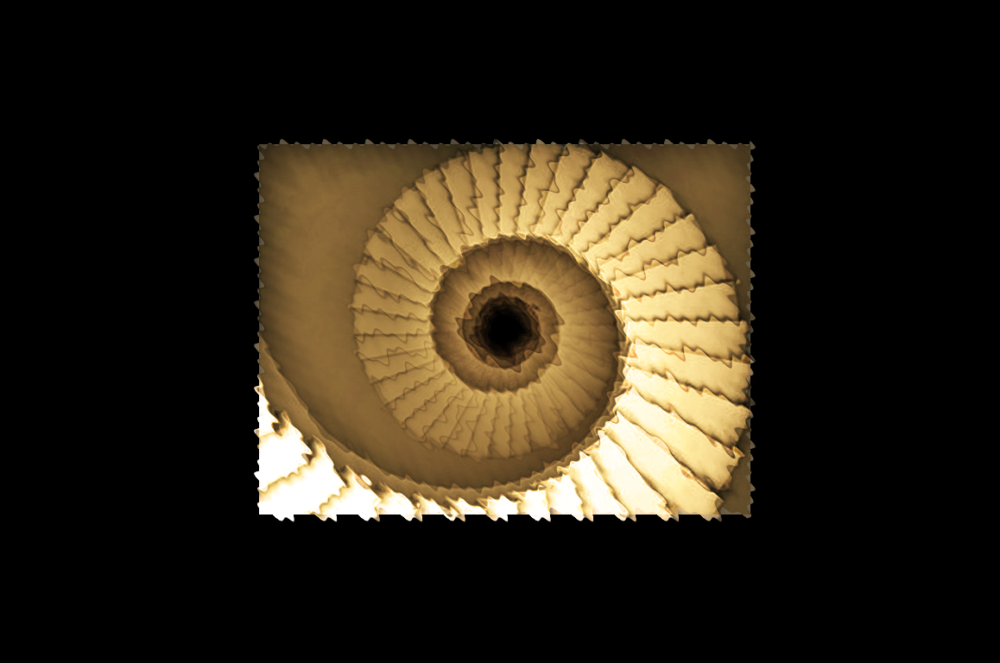

<!-- PROJECT LOGO -->
<br />
<div align="center">
  
  <a href="https://github.com/Anthony-Cortese/infinity-forever">
    
  </a>

<h1 align="center" size="54px">Infinity Forever Productions</h1>

  <p align="center">
    <br />
    <a href="www.infinityforeverproductions.com"><strong>View Website</strong></a>
    <br />
    <br />
</div>

## Description

In a past life I was in film school and learning how to become a successful film Director. I wrote and directed my first film, and created my own Production Company called Infinity Forever. After my brother became a professional actor and our Cousins invited us to their yearly Oscar's Party-- It became time to make more films!

I decided to build out a website for Infinity Forever to house all our films, pictures from our various shoots, our Instagram and YouTube pages, as well as all our upcoming futures, and a complete write up "About Us" and our Company. This website was created with our fans in mind, and whoever else is interested to check out our films.

**\***I am not 100% sold on our current logo-- I am always in the lab tweaking as much information as possible. There will be a new logo that we will introduce our next film with!


## Getting Started

### Installation

- yarn

```sh
yarn install
```

```sh
yarn start
```

## Features/Usage


- [x] This is our current logo. The idea is to have this logo represent Infinity & Forever-- This is a spiral staircase currently but I would love a far more simplistic design, and I cant wait to have this logo represent our brand all the way!


- [x] Currently "Screw Jack" is the first film we completed without sending it to the Oscars-- the release date is Fri. September 9th, 2022


- [x] d
  - [ ] Each button takes you to a new page, some buttons even have hover capabilities.


- [ ] The play buttons on the home screen next to movie posters will open up a trailer which is unique to the button pressed.


- [ ] The "Coming Soon to Theatres" section are all short films that I have directed/edited for my amatuer Production Company


- [ ] Responsive website allows information to be hidden and revealed with a horizontal scroll.
  - [ ] Featured Today, Fan Favorites, Exclusive Videos, Explore, On TV, Trending Celebrities, and Top News all have the horizontal scroll functionality!

## Credits


- [x] The two brothers-- WE ARE INFINITY FOREVER!
